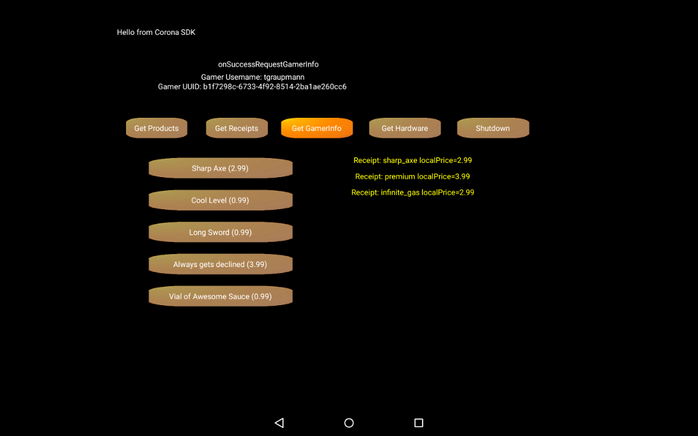

# Corona Game Engine

The [RazerSDK](https://github.com/razerofficial/razer-sdk-docs) can be accessed via the `RazerSDK Corona Plugin`.

### Forums

* [Forge TV on Razer Forums](https://insider.razerzone.com/index.php?forums/razer-forge-tv.126/)

* [Corona on CoronaLabs Forums](http://forums.coronalabs.com/forum/627-ouya/)

## Resources

* Download [Corona SDK](https://developer.coronalabs.com/downloads/coronasdk)

* Learn from [Corona Resources](http://coronalabs.com/resources/)

* Watch training videos on [Mastering Corona SDK](http://masteringcoronasdk.com/)

* Read the [Lua Spec](http://www.lua.org/manual/5.3/)

## Quick Start

### Corona Simulator

* Download and install [CoronaSDK](https://developer.coronalabs.com/downloads/coronasdk)

* Download and install [JDK7 (32-bit)](https://docs.coronalabs.com/daily/guide/start/installWin/index.html) which is required on Windows in order to handle the keystore properly for Android building

* Activate the [Razer Corona Plugin](https://marketplace.coronalabs.com/plugin/razer-zone-store) on your `Corona` account

### Corona Enterprise

* Download and install [Corona Enterprise Daily Builds](http://developer.coronalabs.com/downloads/enterprise-daily-builds)

* `Corona Enterprise` requires `ant` which requires installing [Homebrew](http://brew.sh/)

* After installing `Homebrew`, update in the terminal

```
brew update
```

* After updating `Homebrew`, install ant in the terminal

```
brew install ant
```

* The Corona Enterprise SDK should be dropped into the `Mac` Application folder

* Authorize Corona Enterprise via the terminal

```
/Applications/CoronaEnterprise/Corona/mac/bin/CoronaBuilder.app/Contents/MacOS/CoronaBuilder authorize your_email your_password
```

* Update the Corona Enterprise SDK local.properties with the following terminal command:

```
android update project --target 1 --path /Applications/CoronaEnterprise/Corona/android/lib/Corona/
```

## Examples 

### In-App-Purchase Example

The [InAppPurchases](https://github.com/razerofficial/corona-plugin-razer-sdk/tree/master/InAppPurchases) sample works as both a `Corona Simulator` and a `Corona Enterprise` project.



#### Corona Simulator

* `Corona Simulator` works with the free `Corona SDK` and compiles on both `Mac` and `Windows`.

* Open [main.lua](https://github.com/razerofficial/corona-plugin-razer-sdk/blob/master/InAppPurchases/Corona/main.lua) from the Corona Simulator

* Use the `File->Build->Android` menu item and enter `com.razerzone.store.sdk.engine.corona.examples.inapppurchases` for the sample package name.

* The `debug.keystore` password is `android` which should be accepted if JDK7 (32-bit) is installed

* Click `Build` in order to create the Corona Android `APK`

#### Corona Enterprise

* `Corona Enterprise` requires a subscription and must compile on a `Mac` via the terminal.

* Open a `Mac` terminal and switch to the `InAppPurchases/android` folder

* Run the following command to generate the `local.properties` file

```
android update project --path . --subprojects --target android-21
```

* The example uses the `debug.keystore` which needs the following added to the `local.properties` file:

```
key.alias=androiddebugkey
key.store=debug.keystore
key.store.password=android
key.alias.password=android
```

## Razer SDK

The `RazerSDK` can be accessed using the [Corona RazerSDK Plugin](https://marketplace.coronalabs.com/plugin/razer-zone-store) which provides access to the `Lua API`.

### Build.settings

Edit the [build.settings](https://github.com/razerofficial/corona-plugin-razer-sdk/blob/master/InAppPurchases/Corona/build.settings) to specify the `Razer` plugin.

```
settings =
{
	plugins =
	{
		["plugin.razerStore"] =
		{
			publisherId = "com.razerzone"
		},
	},
}
```

The `Game` intent filter can be added through the `Android` intent settings.

```
settings =
{
    android =
    {
           mainIntentFilter =
           {
                   categories = { "com.razerzone.store.category.GAME" },
           }
	}
}
```

The minimum SDK version can be added through the `Android` settings.

```
settings =
{
    android =
    {
           minSdkVersion = "21"
	}
}
```

The `Android TV` game setting can be added through the `Android` settings.

```
settings =
{
    android =
    {
           isGame = true
	}
}
```

### Icons

* The `Android` [icon](https://docs.coronalabs.com/daily/guide/distribution/buildSettings/index.html#android) page specifies the icon naming convention. Content review requires that the `Icon-mdpi.png` at `48x48` must be used.

### Initialization

* Before invoking `RazerSDK` functions, the Corona plugin needs to be loaded. The `Corona` plugin should not be loaded in the simulator environment.

```
if (system.getInfo("environment") ~= "simulator") then
    print "Loading plugin.razerStore...";
    local plugin_razer_store = require( "plugin.razerStore" )
end
```

* Check that the plugin activity is ready before invoking the initialization methods.

```
local function mainStart( event )
    print( "mainStart called" )

    if nil ~= RazerSDK then
        local isReady = RazerSDK.ActivityIsReady();
        if (isReady == false) then
            -- wait for activity to be ready
            timer.performWithDelay(100, mainStart);
            return;
        else
            -- ready to initialize the Corona plugin
        end

    end
end
```

### OnFailure

Plugin Lua `failure` callbacks return an `errorCode` number and `errorMessage` string when used by `RazerSDK` function calls.

### OnCancel

Plugin Lua `cancel` callbacks have no parameters when used by `RazerSDK` function calls.

### InitPlugin

```
    callbacksInitPlugin = require "callbacksInitPlugin"

    if (RazerSDK ~= nil) then
        local secretApiKey = "eyJkZXZlbG9wZXJfaWQi";
        secretApiKey = secretApiKey .. "OiIzMTBhOGY1MS00ZDZl";
        secretApiKey = secretApiKey .. "LTRhZTUtYmRhMC1iOTM4";
        secretApiKey = secretApiKey .. "NzhlNWY1ZDAiLCJkZXZl";
        secretApiKey = secretApiKey .. "bG9wZXJfcHVibGljX2tl";
        secretApiKey = secretApiKey .. "eSI6Ik1JR2ZNQTBHQ1Nx";
        secretApiKey = secretApiKey .. "R1NJYjNEUUVCQVFVQUE0";
        secretApiKey = secretApiKey .. "R05BRENCaVFLQmdRQ3Va";
        secretApiKey = secretApiKey .. "VWJYQkdVWUxsaVlYRmRG";
        secretApiKey = secretApiKey .. "T0k0bXIvK2RhMTdWL2pN";
        secretApiKey = secretApiKey .. "TXZxTkQ1ZWJpb2pXU0Rt";
        secretApiKey = secretApiKey .. "ZEZud255anVSUGZTVzY4";
        secretApiKey = secretApiKey .. "ZkUrN0QvdElPOWlsdm8w";
        secretApiKey = secretApiKey .. "MXc0aEVNeDhpUXVyRDBP";
        secretApiKey = secretApiKey .. "bTFNMDlENHRUTE5MdGp2";
        secretApiKey = secretApiKey .. "dW1zMm82ZWQ1eGlSVFJS";
        secretApiKey = secretApiKey .. "TG8zVFJTNWFFMlJQczdj";
        secretApiKey = secretApiKey .. "VjBZblJjek1iU3V1TG5U";
        secretApiKey = secretApiKey .. "bVlVMGMzMFlhOSt3MjNn";
        secretApiKey = secretApiKey .. "OVBiUUlEQVFBQiJ9";

        RazerSDK.InitPlugin(callbacksInitPlugin.onSuccess, callbacksInitPlugin.onFailure, secretApiKey);
    end
```

### RequestGamerInfo

```
    callbacksRequestGamerInfo = require "callbacksRequestGamerInfo"

    if (RazerSDK ~= nil) then
        RazerSDK.RequestGamerInfo(callbacksRequestGamerInfo.onSuccess, callbacksRequestGamerInfo.onFailure, callbacksRequestGamerInfo.onCancel);
    end
```

### RequestProducts

```
    callbacksRequestProducts = require "callbacksRequestProducts"

    if (RazerSDK ~= nil) then
        local products =  { "long_sword", "sharp_axe", "cool_level", "awesome_sauce", "__DECLINED__THIS_PURCHASE" };
        local jsonData = json.encode(products);
        RazerSDK.RequestProducts(callbacksRequestProducts.onSuccess, callbacksRequestProducts.onFailure, callbacksRequestProducts.onCancel, jsonData);
    end
```

### RequestPurchase

```
    callbacksRequestPurchase = require "callbacksRequestPurchase"

    local identifier = "long_sword";

    -- purchase an entitlement    
    if (RazerSDK ~= nil) then
        local productType = "ENTITLEMENT";
        RazerSDK.RequestPurchase(callbacksRequestPurchase.onSuccess, callbacksRequestPurchase.onFailure, callbacksRequestPurchase.onCancel, identifier, productType);
    end

    -- purchase an consumable    
    if (RazerSDK ~= nil) then
        local productType = "CONSUMABLE";
        RazerSDK.RequestPurchase(callbacksRequestPurchase.onSuccess, callbacksRequestPurchase.onFailure, callbacksRequestPurchase.onCancel, identifier, productType);
    end
```

### RequestReceipts

```
    callbacksRequestReceipts = require "callbacksRequestReceipts"

    if (RazerSDK ~= nil) then
        RazerSDK.RequestReceipts(callbacksRequestReceipts.onSuccess, callbacksRequestReceipts.onFailure, callbacksRequestReceipts.onCancel);
    end
```

### Shutdown

```
    callbacksShutdown = require "callbacksShutdown"

    if (RazerSDK ~= nil) then
        RazerSDK.Shutdown(callbacksShutdown.onSuccess, callbacksShutdown.onFailure);
    end
```

### Quit

This method should only be invoked after the `RazerSDK` has been shutdown if the `RazerSDK` had successfully initialized. The `RazerSDK.Quit` method will finish the plugin activity. The `native.requestExit` method will cause `Corona` to exit the application. 

```
    if (RazerSDK ~= nil) then
        RazerSDK.Quit();
    end
    native.requestExit();
```
